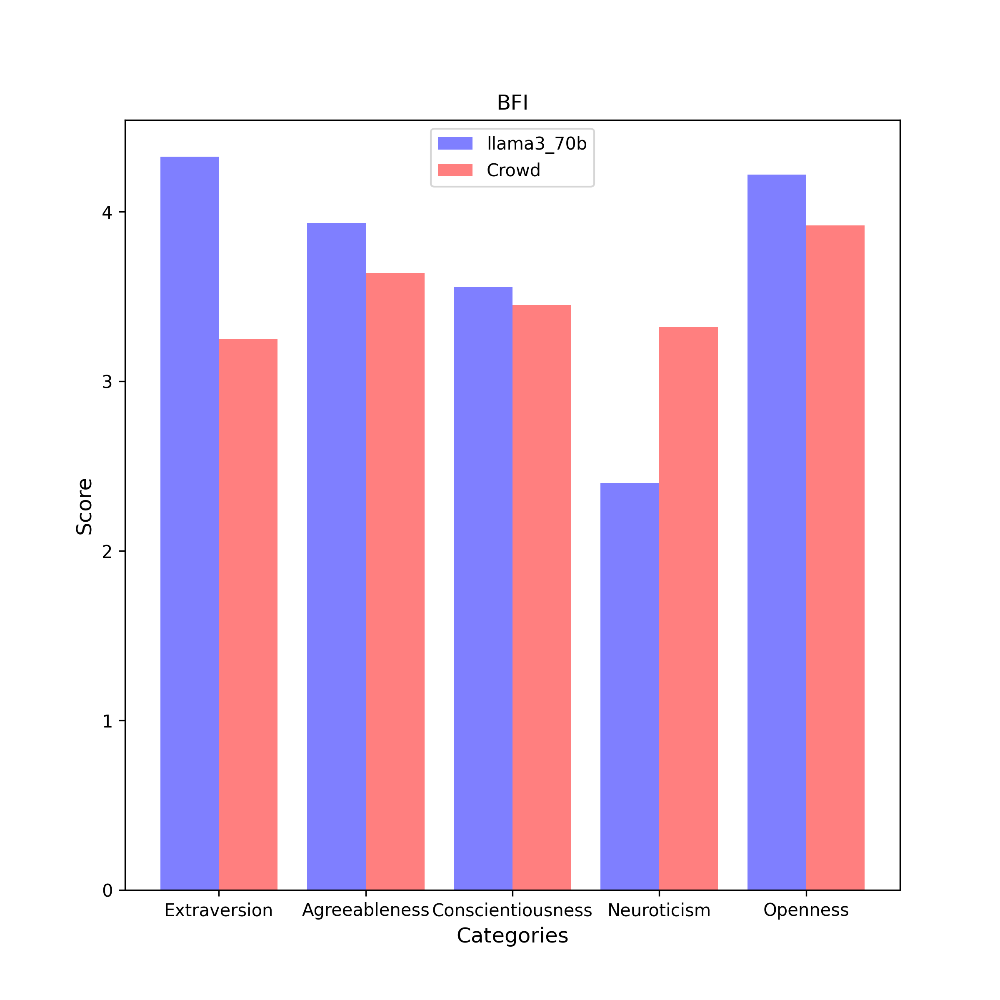

# BFI Results

| Category | llama3_70b (n = 5) | Crowd (n = 6076) |
| :---: | :---: | :---: |
| Extraversion | 4.3 $\pm$ 0.2 | 3.2 $\pm$ 0.9 | 
| Agreeableness | 3.9 $\pm$ 0.2 | 3.6 $\pm$ 0.7 | 
| Conscientiousness | 3.6 $\pm$ 0.3 | 3.5 $\pm$ 0.7 | 
| Neuroticism | 2.4 $\pm$ 0.2 | 3.3 $\pm$ 0.8 | 
| Openness | 4.2 $\pm$ 0.1 | 3.9 $\pm$ 0.7 | 

## Extraversion
### Compare with Crowd

- **Statistic**:
llama3_70b:	mean1 = 4.3,	std1 = 0.2,	n1 = 5
Crowd:	mean2 = 3.2,	std2 = 0.9,	n2 = 6076

- **F-Test:**

	f-value = 13.6421	($df_1$ = 6075, $df_2$ = 4)

	p-value = 0.0195	(two-tailed test)

	Null hypothesis $H_0$ ($s_1^2$ = $s_2^2$): 	Since p-value (0.0195) > α (0.01), $H_0$ cannot be rejected.

	**Conclusion ($s_1^2$ = $s_2^2$):** The variance of average scores responsed by llama3_70b is statistically equal to that responsed by Crowd in this category.

- **Two Sample T-Test (Equal Variance):**

	t-value = 2.6706	($df$ = 6079.0)

	p-value = 0.0076	(two-tailed test)

	Null hypothesis $H_0$ ($µ_1$ = $µ_2$): Since p-value (0.0076) < α (0.01), $H_0$ is rejected.

	Alternative hypothesis $H_1$ ($µ_1$ > $µ_2$): 	Since p-value (1.0) > α (0.01), $H_1$ cannot be rejected.

	**Conclusion ($µ_1$ > $µ_2$):** The average scores of llama3_70b is assumed to be larger than the average scores of Crowd in this category.

## Agreeableness
### Compare with Crowd

- **Statistic**:
llama3_70b:	mean1 = 3.9,	std1 = 0.2,	n1 = 5
Crowd:	mean2 = 3.6,	std2 = 0.7,	n2 = 6076

- **F-Test:**

	f-value = 14.9966	($df_1$ = 6075, $df_2$ = 4)

	p-value = 0.0163	(two-tailed test)

	Null hypothesis $H_0$ ($s_1^2$ = $s_2^2$): 	Since p-value (0.0163) > α (0.01), $H_0$ cannot be rejected.

	**Conclusion ($s_1^2$ = $s_2^2$):** The variance of average scores responsed by llama3_70b is statistically equal to that responsed by Crowd in this category.

- **Two Sample T-Test (Equal Variance):**

	t-value = 0.9109	($df$ = 6079.0)

	p-value = 0.3624	(two-tailed test)

	Null hypothesis $H_0$ ($µ_1$ = $µ_2$): 	Since p-value (0.3624) > α (0.01), $H_0$ cannot be rejected.

	**Conclusion ($µ_1$ = $µ_2$):** The average scores of llama3_70b is assumed to be equal to the average scores of Crowd in this category.

## Conscientiousness
### Compare with Crowd

- **Statistic**:
llama3_70b:	mean1 = 3.6,	std1 = 0.3,	n1 = 5
Crowd:	mean2 = 3.5,	std2 = 0.7,	n2 = 6076

- **F-Test:**

	f-value = 7.8482	($df_1$ = 6075, $df_2$ = 4)

	p-value = 0.0549	(two-tailed test)

	Null hypothesis $H_0$ ($s_1^2$ = $s_2^2$): 	Since p-value (0.0549) > α (0.01), $H_0$ cannot be rejected.

	**Conclusion ($s_1^2$ = $s_2^2$):** The variance of average scores responsed by llama3_70b is statistically equal to that responsed by Crowd in this category.

- **Two Sample T-Test (Equal Variance):**

	t-value = 0.3233	($df$ = 6079.0)

	p-value = 0.7465	(two-tailed test)

	Null hypothesis $H_0$ ($µ_1$ = $µ_2$): 	Since p-value (0.7465) > α (0.01), $H_0$ cannot be rejected.

	**Conclusion ($µ_1$ = $µ_2$):** The average scores of llama3_70b is assumed to be equal to the average scores of Crowd in this category.

## Neuroticism
### Compare with Crowd

- **Statistic**:
llama3_70b:	mean1 = 2.4,	std1 = 0.2,	n1 = 5
Crowd:	mean2 = 3.3,	std2 = 0.8,	n2 = 6076

- **F-Test:**

	f-value = 13.4480	($df_1$ = 6075, $df_2$ = 4)

	p-value = 0.0200	(two-tailed test)

	Null hypothesis $H_0$ ($s_1^2$ = $s_2^2$): 	Since p-value (0.0200) > α (0.01), $H_0$ cannot be rejected.

	**Conclusion ($s_1^2$ = $s_2^2$):** The variance of average scores responsed by llama3_70b is statistically equal to that responsed by Crowd in this category.

- **Two Sample T-Test (Equal Variance):**

	t-value = -2.5085	($df$ = 6079.0)

	p-value = 0.0122	(two-tailed test)

	Null hypothesis $H_0$ ($µ_1$ = $µ_2$): 	Since p-value (0.0122) > α (0.01), $H_0$ cannot be rejected.

	**Conclusion ($µ_1$ = $µ_2$):** The average scores of llama3_70b is assumed to be equal to the average scores of Crowd in this category.

## Openness
### Compare with Crowd

- **Statistic**:
llama3_70b:	mean1 = 4.2,	std1 = 0.1,	n1 = 5
Crowd:	mean2 = 3.9,	std2 = 0.7,	n2 = 6076

- **F-Test:**

	f-value = 36.3000	($df_1$ = 6075, $df_2$ = 4)

	p-value = 0.0029	(two-tailed test)

	Null hypothesis $H_0$ ($s_1^2$ = $s_2^2$): 	Since p-value (0.0029) < α (0.01), $H_0$ is rejected.

	**Conclusion ($s_1^2$ ≠ $s_2^2$):** The variance of average scores responsed by llama3_70b is statistically unequal to that responsed by Crowd in this category.

- **Two Sample T-test (Welch's T-Test):**

	t-value = 6.0343	($df$ = 4.2)

	p-value = 0.0031	(two-tailed test)

	Null hypothesis $H_0$ ($µ_1$ = $µ_2$): Since p-value (0.0031) < α (0.01), $H_0$ is rejected.

	Alternative hypothesis $H_1$ ($µ_1$ > $µ_2$): 	Since p-value (1.0) > α (0.01), $H_1$ cannot be rejected.

	**Conclusion ($µ_1$ > $µ_2$):** The average scores of llama3_70b is assumed to be larger than the average scores of Crowd in this category.

