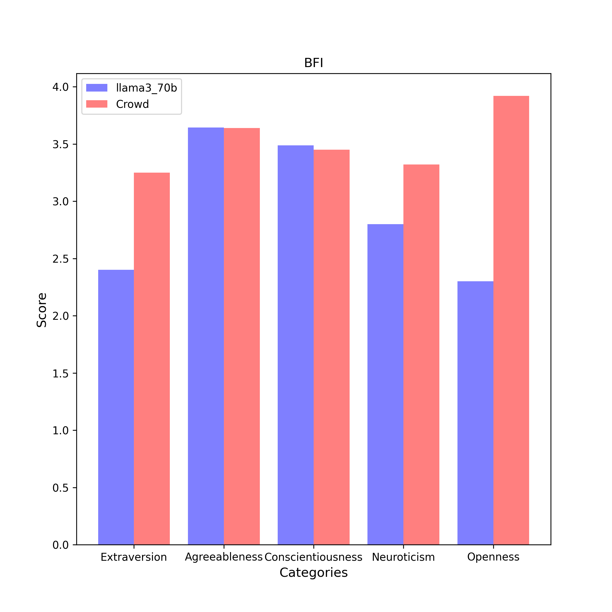

# BFI Results

| Category | llama3_70b (n = 5) | Crowd (n = 6076) |
| :---: | :---: | :---: |
| Extraversion | 2.4 $\pm$ 0.2 | 3.2 $\pm$ 0.9 | 
| Agreeableness | 3.6 $\pm$ 0.1 | 3.6 $\pm$ 0.7 | 
| Conscientiousness | 3.5 $\pm$ 0.1 | 3.5 $\pm$ 0.7 | 
| Neuroticism | 2.8 $\pm$ 0.1 | 3.3 $\pm$ 0.8 | 
| Openness | 2.3 $\pm$ 0.1 | 3.9 $\pm$ 0.7 | 

## Extraversion
### Compare with Crowd

- **Statistic**:
llama3_70b:	mean1 = 2.4,	std1 = 0.2,	n1 = 5
Crowd:	mean2 = 3.2,	std2 = 0.9,	n2 = 6076

- **F-Test:**

	f-value = 23.5636	($df_1$ = 6075, $df_2$ = 4)

	p-value = 0.0068	(two-tailed test)

	Null hypothesis $H_0$ ($s_1^2$ = $s_2^2$): 	Since p-value (0.0068) < α (0.01), $H_0$ is rejected.

	**Conclusion ($s_1^2$ ≠ $s_2^2$):** The variance of average scores responsed by llama3_70b is statistically unequal to that responsed by Crowd in this category.

- **Two Sample T-test (Welch's T-Test):**

	t-value = -10.1534	($df$ = 4.2)

	p-value = 0.0004	(two-tailed test)

	Null hypothesis $H_0$ ($µ_1$ = $µ_2$): Since p-value (0.0004) < α (0.01), $H_0$ is rejected.

	Alternative hypothesis $H_1$ ($µ_1$ < $µ_2$): 	Since p-value (1.0) > α (0.01), $H_1$ cannot be rejected.

	**Conclusion ($µ_1$ < $µ_2$):** The average scores of llama3_70b is assumed to be smaller than the average scores of Crowd in this category.

## Agreeableness
### Compare with Crowd

- **Statistic**:
llama3_70b:	mean1 = 3.6,	std1 = 0.1,	n1 = 5
Crowd:	mean2 = 3.6,	std2 = 0.7,	n2 = 6076

- **F-Test:**

	f-value = 34.9920	($df_1$ = 6075, $df_2$ = 4)

	p-value = 0.0031	(two-tailed test)

	Null hypothesis $H_0$ ($s_1^2$ = $s_2^2$): 	Since p-value (0.0031) < α (0.01), $H_0$ is rejected.

	**Conclusion ($s_1^2$ ≠ $s_2^2$):** The variance of average scores responsed by llama3_70b is statistically unequal to that responsed by Crowd in this category.

- **Two Sample T-test (Welch's T-Test):**

	t-value = 0.0805	($df$ = 4.2)

	p-value = 0.9395	(two-tailed test)

	Null hypothesis $H_0$ ($µ_1$ = $µ_2$): 	Since p-value (0.9395) > α (0.01), $H_0$ cannot be rejected.

	**Conclusion ($µ_1$ = $µ_2$):** The average scores of llama3_70b is assumed to be equal to the average scores of Crowd in this category.

## Conscientiousness
### Compare with Crowd

- **Statistic**:
llama3_70b:	mean1 = 3.5,	std1 = 0.1,	n1 = 5
Crowd:	mean2 = 3.5,	std2 = 0.7,	n2 = 6076

- **F-Test:**

	f-value = 23.9805	($df_1$ = 6075, $df_2$ = 4)

	p-value = 0.0066	(two-tailed test)

	Null hypothesis $H_0$ ($s_1^2$ = $s_2^2$): 	Since p-value (0.0066) < α (0.01), $H_0$ is rejected.

	**Conclusion ($s_1^2$ ≠ $s_2^2$):** The variance of average scores responsed by llama3_70b is statistically unequal to that responsed by Crowd in this category.

- **Two Sample T-test (Welch's T-Test):**

	t-value = 0.5777	($df$ = 4.2)

	p-value = 0.5933	(two-tailed test)

	Null hypothesis $H_0$ ($µ_1$ = $µ_2$): 	Since p-value (0.5933) > α (0.01), $H_0$ cannot be rejected.

	**Conclusion ($µ_1$ = $µ_2$):** The average scores of llama3_70b is assumed to be equal to the average scores of Crowd in this category.

## Neuroticism
### Compare with Crowd

- **Statistic**:
llama3_70b:	mean1 = 2.8,	std1 = 0.1,	n1 = 5
Crowd:	mean2 = 3.3,	std2 = 0.8,	n2 = 6076

- **F-Test:**

	f-value = 33.1028	($df_1$ = 6075, $df_2$ = 4)

	p-value = 0.0035	(two-tailed test)

	Null hypothesis $H_0$ ($s_1^2$ = $s_2^2$): 	Since p-value (0.0035) < α (0.01), $H_0$ is rejected.

	**Conclusion ($s_1^2$ ≠ $s_2^2$):** The variance of average scores responsed by llama3_70b is statistically unequal to that responsed by Crowd in this category.

- **Two Sample T-test (Welch's T-Test):**

	t-value = -8.0495	($df$ = 4.2)

	p-value = 0.0010	(two-tailed test)

	Null hypothesis $H_0$ ($µ_1$ = $µ_2$): Since p-value (0.0010) < α (0.01), $H_0$ is rejected.

	Alternative hypothesis $H_1$ ($µ_1$ < $µ_2$): 	Since p-value (1.0) > α (0.01), $H_1$ cannot be rejected.

	**Conclusion ($µ_1$ < $µ_2$):** The average scores of llama3_70b is assumed to be smaller than the average scores of Crowd in this category.

## Openness
### Compare with Crowd

- **Statistic**:
llama3_70b:	mean1 = 2.3,	std1 = 0.1,	n1 = 5
Crowd:	mean2 = 3.9,	std2 = 0.7,	n2 = 6076

- **F-Test:**

	f-value = 43.5600	($df_1$ = 6075, $df_2$ = 4)

	p-value = 0.0020	(two-tailed test)

	Null hypothesis $H_0$ ($s_1^2$ = $s_2^2$): 	Since p-value (0.0020) < α (0.01), $H_0$ is rejected.

	**Conclusion ($s_1^2$ ≠ $s_2^2$):** The variance of average scores responsed by llama3_70b is statistically unequal to that responsed by Crowd in this category.

- **Two Sample T-test (Welch's T-Test):**

	t-value = -35.5920	($df$ = 4.3)

	p-value = 0.0000	(two-tailed test)

	Null hypothesis $H_0$ ($µ_1$ = $µ_2$): Since p-value (0.0000) < α (0.01), $H_0$ is rejected.

	Alternative hypothesis $H_1$ ($µ_1$ < $µ_2$): 	Since p-value (1.0) > α (0.01), $H_1$ cannot be rejected.

	**Conclusion ($µ_1$ < $µ_2$):** The average scores of llama3_70b is assumed to be smaller than the average scores of Crowd in this category.

