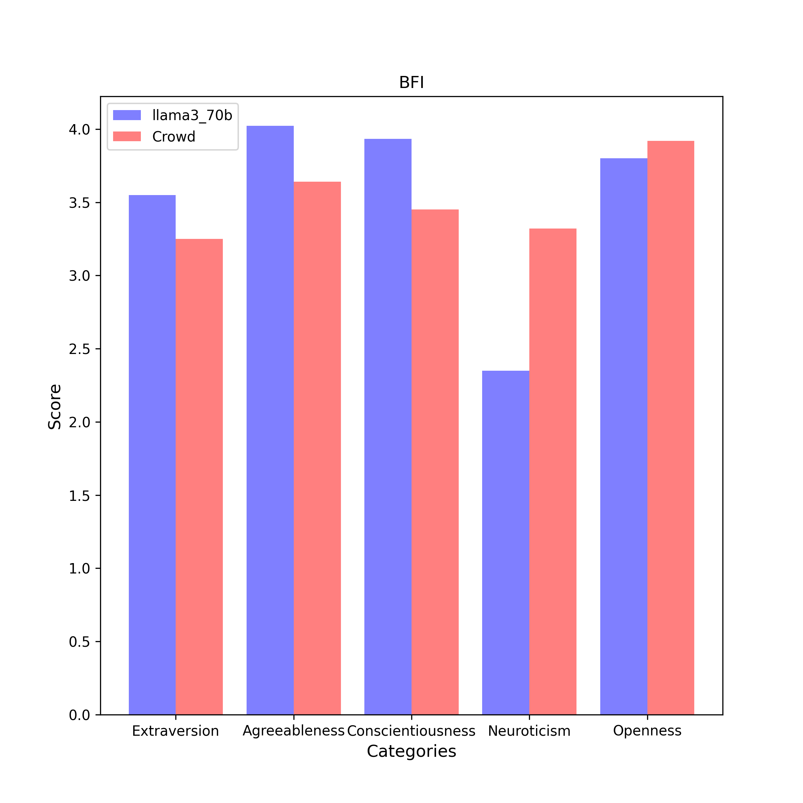

# BFI Results

| Category | llama3_70b (n = 5) | Crowd (n = 6076) |
| :---: | :---: | :---: |
| Extraversion | 3.5 $\pm$ 0.1 | 3.2 $\pm$ 0.9 | 
| Agreeableness | 4.0 $\pm$ 0.1 | 3.6 $\pm$ 0.7 | 
| Conscientiousness | 3.9 $\pm$ 0.2 | 3.5 $\pm$ 0.7 | 
| Neuroticism | 2.4 $\pm$ 0.2 | 3.3 $\pm$ 0.8 | 
| Openness | 3.8 $\pm$ 0.2 | 3.9 $\pm$ 0.7 | 

## Extraversion
### Compare with Crowd

- **Statistic**:
llama3_70b:	mean1 = 3.5,	std1 = 0.1,	n1 = 5
Crowd:	mean2 = 3.2,	std2 = 0.9,	n2 = 6076

- **F-Test:**

	f-value = 64.8000	($df_1$ = 6075, $df_2$ = 4)

	p-value = 0.0009	(two-tailed test)

	Null hypothesis $H_0$ ($s_1^2$ = $s_2^2$): 	Since p-value (0.0009) < α (0.01), $H_0$ is rejected.

	**Conclusion ($s_1^2$ ≠ $s_2^2$):** The variance of average scores responsed by llama3_70b is statistically unequal to that responsed by Crowd in this category.

- **Two Sample T-test (Welch's T-Test):**

	t-value = 5.8462	($df$ = 4.4)

	p-value = 0.0031	(two-tailed test)

	Null hypothesis $H_0$ ($µ_1$ = $µ_2$): Since p-value (0.0031) < α (0.01), $H_0$ is rejected.

	Alternative hypothesis $H_1$ ($µ_1$ > $µ_2$): 	Since p-value (1.0) > α (0.01), $H_1$ cannot be rejected.

	**Conclusion ($µ_1$ > $µ_2$):** The average scores of llama3_70b is assumed to be larger than the average scores of Crowd in this category.

## Agreeableness
### Compare with Crowd

- **Statistic**:
llama3_70b:	mean1 = 4.0,	std1 = 0.1,	n1 = 5
Crowd:	mean2 = 3.6,	std2 = 0.7,	n2 = 6076

- **F-Test:**

	f-value = 24.7002	($df_1$ = 6075, $df_2$ = 4)

	p-value = 0.0062	(two-tailed test)

	Null hypothesis $H_0$ ($s_1^2$ = $s_2^2$): 	Since p-value (0.0062) < α (0.01), $H_0$ is rejected.

	**Conclusion ($s_1^2$ ≠ $s_2^2$):** The variance of average scores responsed by llama3_70b is statistically unequal to that responsed by Crowd in this category.

- **Two Sample T-test (Welch's T-Test):**

	t-value = 5.8405	($df$ = 4.2)

	p-value = 0.0038	(two-tailed test)

	Null hypothesis $H_0$ ($µ_1$ = $µ_2$): Since p-value (0.0038) < α (0.01), $H_0$ is rejected.

	Alternative hypothesis $H_1$ ($µ_1$ > $µ_2$): 	Since p-value (1.0) > α (0.01), $H_1$ cannot be rejected.

	**Conclusion ($µ_1$ > $µ_2$):** The average scores of llama3_70b is assumed to be larger than the average scores of Crowd in this category.

## Conscientiousness
### Compare with Crowd

- **Statistic**:
llama3_70b:	mean1 = 3.9,	std1 = 0.2,	n1 = 5
Crowd:	mean2 = 3.5,	std2 = 0.7,	n2 = 6076

- **F-Test:**

	f-value = 18.7673	($df_1$ = 6075, $df_2$ = 4)

	p-value = 0.0106	(two-tailed test)

	Null hypothesis $H_0$ ($s_1^2$ = $s_2^2$): 	Since p-value (0.0106) > α (0.01), $H_0$ cannot be rejected.

	**Conclusion ($s_1^2$ = $s_2^2$):** The variance of average scores responsed by llama3_70b is statistically equal to that responsed by Crowd in this category.

- **Two Sample T-Test (Equal Variance):**

	t-value = 1.4804	($df$ = 6079.0)

	p-value = 0.1388	(two-tailed test)

	Null hypothesis $H_0$ ($µ_1$ = $µ_2$): 	Since p-value (0.1388) > α (0.01), $H_0$ cannot be rejected.

	**Conclusion ($µ_1$ = $µ_2$):** The average scores of llama3_70b is assumed to be equal to the average scores of Crowd in this category.

## Neuroticism
### Compare with Crowd

- **Statistic**:
llama3_70b:	mean1 = 2.4,	std1 = 0.2,	n1 = 5
Crowd:	mean2 = 3.3,	std2 = 0.8,	n2 = 6076

- **F-Test:**

	f-value = 11.6307	($df_1$ = 6075, $df_2$ = 4)

	p-value = 0.0264	(two-tailed test)

	Null hypothesis $H_0$ ($s_1^2$ = $s_2^2$): 	Since p-value (0.0264) > α (0.01), $H_0$ cannot be rejected.

	**Conclusion ($s_1^2$ = $s_2^2$):** The variance of average scores responsed by llama3_70b is statistically equal to that responsed by Crowd in this category.

- **Two Sample T-Test (Equal Variance):**

	t-value = -2.6448	($df$ = 6079.0)

	p-value = 0.0082	(two-tailed test)

	Null hypothesis $H_0$ ($µ_1$ = $µ_2$): Since p-value (0.0082) < α (0.01), $H_0$ is rejected.

	Alternative hypothesis $H_1$ ($µ_1$ < $µ_2$): 	Since p-value (1.0) > α (0.01), $H_1$ cannot be rejected.

	**Conclusion ($µ_1$ < $µ_2$):** The average scores of llama3_70b is assumed to be smaller than the average scores of Crowd in this category.

## Openness
### Compare with Crowd

- **Statistic**:
llama3_70b:	mean1 = 3.8,	std1 = 0.2,	n1 = 5
Crowd:	mean2 = 3.9,	std2 = 0.7,	n2 = 6076

- **F-Test:**

	f-value = 10.8900	($df_1$ = 6075, $df_2$ = 4)

	p-value = 0.0299	(two-tailed test)

	Null hypothesis $H_0$ ($s_1^2$ = $s_2^2$): 	Since p-value (0.0299) > α (0.01), $H_0$ cannot be rejected.

	**Conclusion ($s_1^2$ = $s_2^2$):** The variance of average scores responsed by llama3_70b is statistically equal to that responsed by Crowd in this category.

- **Two Sample T-Test (Equal Variance):**

	t-value = -0.4065	($df$ = 6079.0)

	p-value = 0.6844	(two-tailed test)

	Null hypothesis $H_0$ ($µ_1$ = $µ_2$): 	Since p-value (0.6844) > α (0.01), $H_0$ cannot be rejected.

	**Conclusion ($µ_1$ = $µ_2$):** The average scores of llama3_70b is assumed to be equal to the average scores of Crowd in this category.

