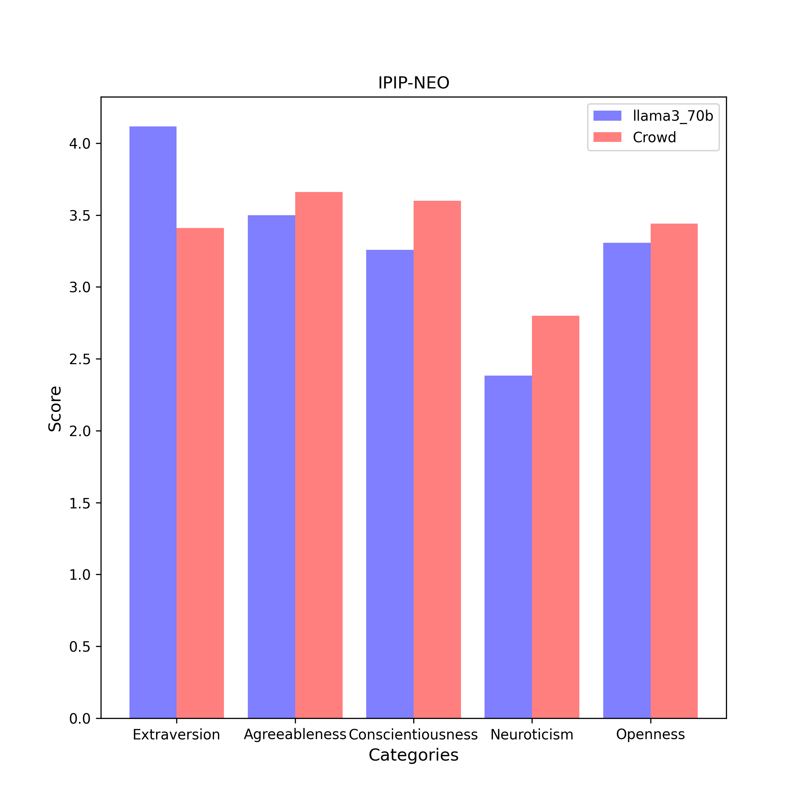

# IPIP-NEO Results

| Category | llama3_70b (n = 5) | Crowd (n = 619150) |
| :---: | :---: | :---: |
| Extraversion | 4.1 $\pm$ 0.1 | 3.4 $\pm$ 1.0 | 
| Agreeableness | 3.5 $\pm$ 0.1 | 3.7 $\pm$ 1.0 | 
| Conscientiousness | 3.3 $\pm$ 0.2 | 3.6 $\pm$ 1.0 | 
| Neuroticism | 2.4 $\pm$ 0.2 | 2.8 $\pm$ 1.0 | 
| Openness | 3.3 $\pm$ 0.1 | 3.4 $\pm$ 1.1 | 

## Extraversion
### Compare with Crowd

- **Statistic**:
llama3_70b:	mean1 = 4.1,	std1 = 0.1,	n1 = 5
Crowd:	mean2 = 3.4,	std2 = 1.0,	n2 = 619150

- **F-Test:**

	f-value = 107.2067	($df_1$ = 619149, $df_2$ = 4)

	p-value = 0.0003	(two-tailed test)

	Null hypothesis $H_0$ ($s_1^2$ = $s_2^2$): 	Since p-value (0.0003) < α (0.01), $H_0$ is rejected.

	**Conclusion ($s_1^2$ ≠ $s_2^2$):** The variance of average scores responsed by llama3_70b is statistically unequal to that responsed by Crowd in this category.

- **Two Sample T-test (Welch's T-Test):**

	t-value = 15.8776	($df$ = 4.0)

	p-value = 0.0001	(two-tailed test)

	Null hypothesis $H_0$ ($µ_1$ = $µ_2$): Since p-value (0.0001) < α (0.01), $H_0$ is rejected.

	Alternative hypothesis $H_1$ ($µ_1$ > $µ_2$): 	Since p-value (1.0) > α (0.01), $H_1$ cannot be rejected.

	**Conclusion ($µ_1$ > $µ_2$):** The average scores of llama3_70b is assumed to be larger than the average scores of Crowd in this category.

## Agreeableness
### Compare with Crowd

- **Statistic**:
llama3_70b:	mean1 = 3.5,	std1 = 0.1,	n1 = 5
Crowd:	mean2 = 3.7,	std2 = 1.0,	n2 = 619150

- **F-Test:**

	f-value = 92.1954	($df_1$ = 619149, $df_2$ = 4)

	p-value = 0.0005	(two-tailed test)

	Null hypothesis $H_0$ ($s_1^2$ = $s_2^2$): 	Since p-value (0.0005) < α (0.01), $H_0$ is rejected.

	**Conclusion ($s_1^2$ ≠ $s_2^2$):** The variance of average scores responsed by llama3_70b is statistically unequal to that responsed by Crowd in this category.

- **Two Sample T-test (Welch's T-Test):**

	t-value = -3.3666	($df$ = 4.0)

	p-value = 0.0281	(two-tailed test)

	Null hypothesis $H_0$ ($µ_1$ = $µ_2$): 	Since p-value (0.0281) > α (0.01), $H_0$ cannot be rejected.

	**Conclusion ($µ_1$ = $µ_2$):** The average scores of llama3_70b is assumed to be equal to the average scores of Crowd in this category.

## Conscientiousness
### Compare with Crowd

- **Statistic**:
llama3_70b:	mean1 = 3.3,	std1 = 0.2,	n1 = 5
Crowd:	mean2 = 3.6,	std2 = 1.0,	n2 = 619150

- **F-Test:**

	f-value = 22.4023	($df_1$ = 619149, $df_2$ = 4)

	p-value = 0.0075	(two-tailed test)

	Null hypothesis $H_0$ ($s_1^2$ = $s_2^2$): 	Since p-value (0.0075) < α (0.01), $H_0$ is rejected.

	**Conclusion ($s_1^2$ ≠ $s_2^2$):** The variance of average scores responsed by llama3_70b is statistically unequal to that responsed by Crowd in this category.

- **Two Sample T-test (Welch's T-Test):**

	t-value = -3.6522	($df$ = 4.0)

	p-value = 0.0217	(two-tailed test)

	Null hypothesis $H_0$ ($µ_1$ = $µ_2$): 	Since p-value (0.0217) > α (0.01), $H_0$ cannot be rejected.

	**Conclusion ($µ_1$ = $µ_2$):** The average scores of llama3_70b is assumed to be equal to the average scores of Crowd in this category.

## Neuroticism
### Compare with Crowd

- **Statistic**:
llama3_70b:	mean1 = 2.4,	std1 = 0.2,	n1 = 5
Crowd:	mean2 = 2.8,	std2 = 1.0,	n2 = 619150

- **F-Test:**

	f-value = 25.7839	($df_1$ = 619149, $df_2$ = 4)

	p-value = 0.0057	(two-tailed test)

	Null hypothesis $H_0$ ($s_1^2$ = $s_2^2$): 	Since p-value (0.0057) < α (0.01), $H_0$ is rejected.

	**Conclusion ($s_1^2$ ≠ $s_2^2$):** The variance of average scores responsed by llama3_70b is statistically unequal to that responsed by Crowd in this category.

- **Two Sample T-test (Welch's T-Test):**

	t-value = -4.5927	($df$ = 4.0)

	p-value = 0.0101	(two-tailed test)

	Null hypothesis $H_0$ ($µ_1$ = $µ_2$): 	Since p-value (0.0101) > α (0.01), $H_0$ cannot be rejected.

	**Conclusion ($µ_1$ = $µ_2$):** The average scores of llama3_70b is assumed to be equal to the average scores of Crowd in this category.

## Openness
### Compare with Crowd

- **Statistic**:
llama3_70b:	mean1 = 3.3,	std1 = 0.1,	n1 = 5
Crowd:	mean2 = 3.4,	std2 = 1.1,	n2 = 619150

- **F-Test:**

	f-value = 102.7291	($df_1$ = 619149, $df_2$ = 4)

	p-value = 0.0004	(two-tailed test)

	Null hypothesis $H_0$ ($s_1^2$ = $s_2^2$): 	Since p-value (0.0004) < α (0.01), $H_0$ is rejected.

	**Conclusion ($s_1^2$ ≠ $s_2^2$):** The variance of average scores responsed by llama3_70b is statistically unequal to that responsed by Crowd in this category.

- **Two Sample T-test (Welch's T-Test):**

	t-value = -2.8140	($df$ = 4.0)

	p-value = 0.0480	(two-tailed test)

	Null hypothesis $H_0$ ($µ_1$ = $µ_2$): 	Since p-value (0.0480) > α (0.01), $H_0$ cannot be rejected.

	**Conclusion ($µ_1$ = $µ_2$):** The average scores of llama3_70b is assumed to be equal to the average scores of Crowd in this category.

