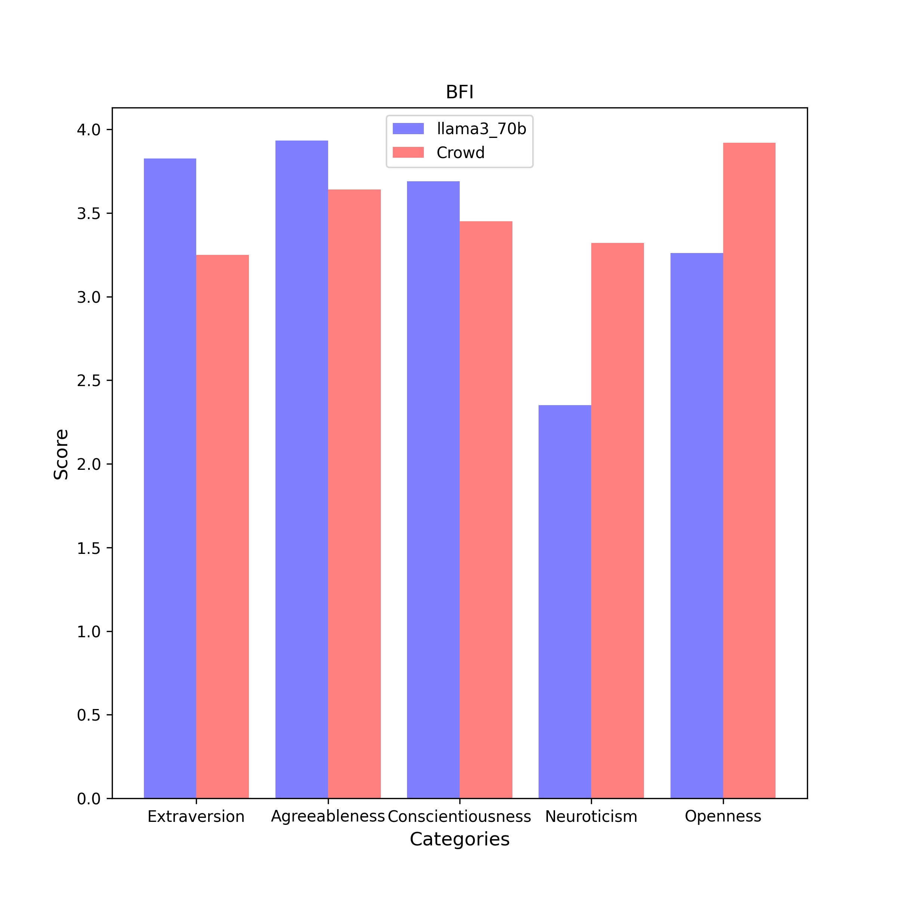

# BFI Results

| Category | llama3_70b (n = 5) | Crowd (n = 6076) |
| :---: | :---: | :---: |
| Extraversion | 3.8 $\pm$ 0.1 | 3.2 $\pm$ 0.9 | 
| Agreeableness | 3.9 $\pm$ 0.1 | 3.6 $\pm$ 0.7 | 
| Conscientiousness | 3.7 $\pm$ 0.1 | 3.5 $\pm$ 0.7 | 
| Neuroticism | 2.4 $\pm$ 0.1 | 3.3 $\pm$ 0.8 | 
| Openness | 3.3 $\pm$ 0.1 | 3.9 $\pm$ 0.7 | 

## Extraversion
### Compare with Crowd

- **Statistic**:
llama3_70b:	mean1 = 3.8,	std1 = 0.1,	n1 = 5
Crowd:	mean2 = 3.2,	std2 = 0.9,	n2 = 6076

- **F-Test:**

	f-value = 64.8000	($df_1$ = 6075, $df_2$ = 4)

	p-value = 0.0009	(two-tailed test)

	Null hypothesis $H_0$ ($s_1^2$ = $s_2^2$): 	Since p-value (0.0009) < α (0.01), $H_0$ is rejected.

	**Conclusion ($s_1^2$ ≠ $s_2^2$):** The variance of average scores responsed by llama3_70b is statistically unequal to that responsed by Crowd in this category.

- **Two Sample T-test (Welch's T-Test):**

	t-value = 11.2051	($df$ = 4.4)

	p-value = 0.0002	(two-tailed test)

	Null hypothesis $H_0$ ($µ_1$ = $µ_2$): Since p-value (0.0002) < α (0.01), $H_0$ is rejected.

	Alternative hypothesis $H_1$ ($µ_1$ > $µ_2$): 	Since p-value (1.0) > α (0.01), $H_1$ cannot be rejected.

	**Conclusion ($µ_1$ > $µ_2$):** The average scores of llama3_70b is assumed to be larger than the average scores of Crowd in this category.

## Agreeableness
### Compare with Crowd

- **Statistic**:
llama3_70b:	mean1 = 3.9,	std1 = 0.1,	n1 = 5
Crowd:	mean2 = 3.6,	std2 = 0.7,	n2 = 6076

- **F-Test:**

	f-value = 52.4880	($df_1$ = 6075, $df_2$ = 4)

	p-value = 0.0014	(two-tailed test)

	Null hypothesis $H_0$ ($s_1^2$ = $s_2^2$): 	Since p-value (0.0014) < α (0.01), $H_0$ is rejected.

	**Conclusion ($s_1^2$ ≠ $s_2^2$):** The variance of average scores responsed by llama3_70b is statistically unequal to that responsed by Crowd in this category.

- **Two Sample T-test (Welch's T-Test):**

	t-value = 6.4619	($df$ = 4.4)

	p-value = 0.0022	(two-tailed test)

	Null hypothesis $H_0$ ($µ_1$ = $µ_2$): Since p-value (0.0022) < α (0.01), $H_0$ is rejected.

	Alternative hypothesis $H_1$ ($µ_1$ > $µ_2$): 	Since p-value (1.0) > α (0.01), $H_1$ cannot be rejected.

	**Conclusion ($µ_1$ > $µ_2$):** The average scores of llama3_70b is assumed to be larger than the average scores of Crowd in this category.

## Conscientiousness
### Compare with Crowd

- **Statistic**:
llama3_70b:	mean1 = 3.7,	std1 = 0.1,	n1 = 5
Crowd:	mean2 = 3.5,	std2 = 0.7,	n2 = 6076

- **F-Test:**

	f-value = 35.9707	($df_1$ = 6075, $df_2$ = 4)

	p-value = 0.0030	(two-tailed test)

	Null hypothesis $H_0$ ($s_1^2$ = $s_2^2$): 	Since p-value (0.0030) < α (0.01), $H_0$ is rejected.

	**Conclusion ($s_1^2$ ≠ $s_2^2$):** The variance of average scores responsed by llama3_70b is statistically unequal to that responsed by Crowd in this category.

- **Two Sample T-test (Welch's T-Test):**

	t-value = 4.3251	($df$ = 4.2)

	p-value = 0.0109	(two-tailed test)

	Null hypothesis $H_0$ ($µ_1$ = $µ_2$): 	Since p-value (0.0109) > α (0.01), $H_0$ cannot be rejected.

	**Conclusion ($µ_1$ = $µ_2$):** The average scores of llama3_70b is assumed to be equal to the average scores of Crowd in this category.

## Neuroticism
### Compare with Crowd

- **Statistic**:
llama3_70b:	mean1 = 2.4,	std1 = 0.1,	n1 = 5
Crowd:	mean2 = 3.3,	std2 = 0.8,	n2 = 6076

- **F-Test:**

	f-value = 35.8613	($df_1$ = 6075, $df_2$ = 4)

	p-value = 0.0030	(two-tailed test)

	Null hypothesis $H_0$ ($s_1^2$ = $s_2^2$): 	Since p-value (0.0030) < α (0.01), $H_0$ is rejected.

	**Conclusion ($s_1^2$ ≠ $s_2^2$):** The variance of average scores responsed by llama3_70b is statistically unequal to that responsed by Crowd in this category.

- **Two Sample T-test (Welch's T-Test):**

	t-value = -15.6114	($df$ = 4.2)

	p-value = 0.0001	(two-tailed test)

	Null hypothesis $H_0$ ($µ_1$ = $µ_2$): Since p-value (0.0001) < α (0.01), $H_0$ is rejected.

	Alternative hypothesis $H_1$ ($µ_1$ < $µ_2$): 	Since p-value (1.0) > α (0.01), $H_1$ cannot be rejected.

	**Conclusion ($µ_1$ < $µ_2$):** The average scores of llama3_70b is assumed to be smaller than the average scores of Crowd in this category.

## Openness
### Compare with Crowd

- **Statistic**:
llama3_70b:	mean1 = 3.3,	std1 = 0.1,	n1 = 5
Crowd:	mean2 = 3.9,	std2 = 0.7,	n2 = 6076

- **F-Test:**

	f-value = 33.5077	($df_1$ = 6075, $df_2$ = 4)

	p-value = 0.0034	(two-tailed test)

	Null hypothesis $H_0$ ($s_1^2$ = $s_2^2$): 	Since p-value (0.0034) < α (0.01), $H_0$ is rejected.

	**Conclusion ($s_1^2$ ≠ $s_2^2$):** The variance of average scores responsed by llama3_70b is statistically unequal to that responsed by Crowd in this category.

- **Two Sample T-test (Welch's T-Test):**

	t-value = -12.7688	($df$ = 4.2)

	p-value = 0.0002	(two-tailed test)

	Null hypothesis $H_0$ ($µ_1$ = $µ_2$): Since p-value (0.0002) < α (0.01), $H_0$ is rejected.

	Alternative hypothesis $H_1$ ($µ_1$ < $µ_2$): 	Since p-value (1.0) > α (0.01), $H_1$ cannot be rejected.

	**Conclusion ($µ_1$ < $µ_2$):** The average scores of llama3_70b is assumed to be smaller than the average scores of Crowd in this category.

