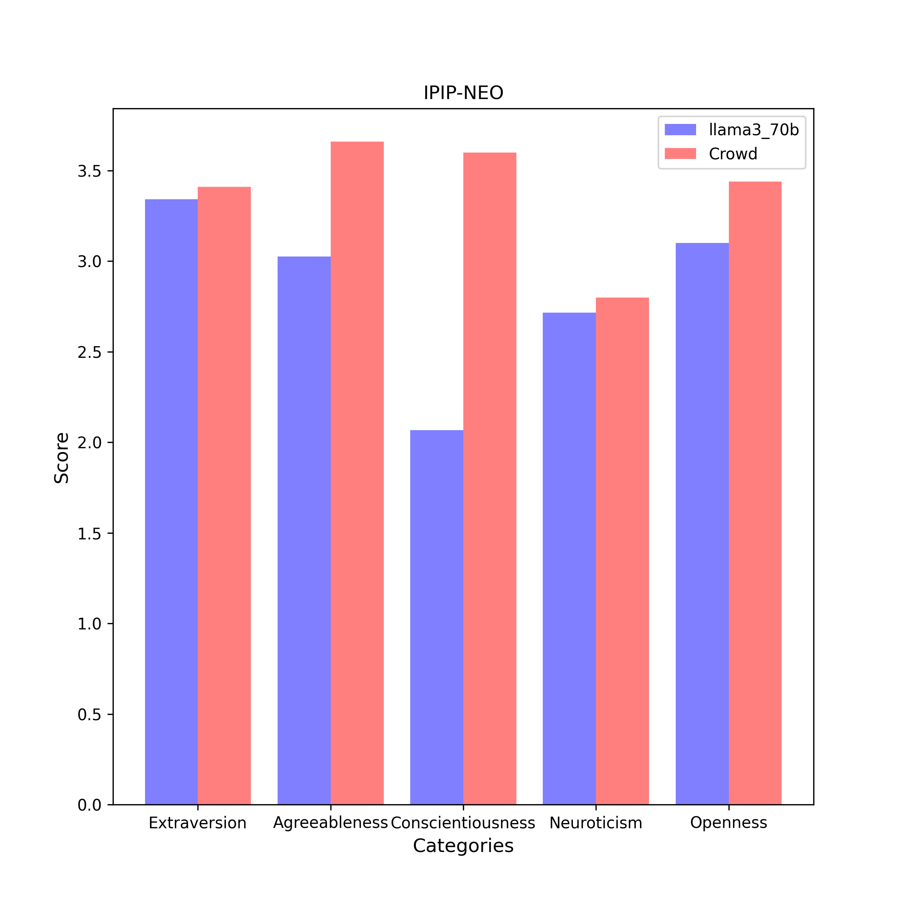

# IPIP-NEO Results

| Category | llama3_70b (n = 5) | Crowd (n = 619150) |
| :---: | :---: | :---: |
| Extraversion | 3.3 $\pm$ 0.0 | 3.4 $\pm$ 1.0 | 
| Agreeableness | 3.0 $\pm$ 0.1 | 3.7 $\pm$ 1.0 | 
| Conscientiousness | 2.1 $\pm$ 0.0 | 3.6 $\pm$ 1.0 | 
| Neuroticism | 2.7 $\pm$ 0.1 | 2.8 $\pm$ 1.0 | 
| Openness | 3.1 $\pm$ 0.1 | 3.4 $\pm$ 1.1 | 

## Extraversion
### Compare with Crowd

- **Statistic**:
llama3_70b:	mean1 = 3.3,	std1 = 0.0,	n1 = 5
Crowd:	mean2 = 3.4,	std2 = 1.0,	n2 = 619150

- **F-Test:**

	f-value = 872.9687	($df_1$ = 619149, $df_2$ = 4)

	p-value = 0.0000	(two-tailed test)

	Null hypothesis $H_0$ ($s_1^2$ = $s_2^2$): 	Since p-value (0.0000) < α (0.01), $H_0$ is rejected.

	**Conclusion ($s_1^2$ ≠ $s_2^2$):** The variance of average scores responsed by llama3_70b is statistically unequal to that responsed by Crowd in this category.

- **Two Sample T-test (Welch's T-Test):**

	t-value = -4.3677	($df$ = 4.1)

	p-value = 0.0116	(two-tailed test)

	Null hypothesis $H_0$ ($µ_1$ = $µ_2$): 	Since p-value (0.0116) > α (0.01), $H_0$ cannot be rejected.

	**Conclusion ($µ_1$ = $µ_2$):** The average scores of llama3_70b is assumed to be equal to the average scores of Crowd in this category.

## Agreeableness
### Compare with Crowd

- **Statistic**:
llama3_70b:	mean1 = 3.0,	std1 = 0.1,	n1 = 5
Crowd:	mean2 = 3.7,	std2 = 1.0,	n2 = 619150

- **F-Test:**

	f-value = 214.0251	($df_1$ = 619149, $df_2$ = 4)

	p-value = 0.0001	(two-tailed test)

	Null hypothesis $H_0$ ($s_1^2$ = $s_2^2$): 	Since p-value (0.0001) < α (0.01), $H_0$ is rejected.

	**Conclusion ($s_1^2$ ≠ $s_2^2$):** The variance of average scores responsed by llama3_70b is statistically unequal to that responsed by Crowd in this category.

- **Two Sample T-test (Welch's T-Test):**

	t-value = -20.3477	($df$ = 4.0)

	p-value = 0.0000	(two-tailed test)

	Null hypothesis $H_0$ ($µ_1$ = $µ_2$): Since p-value (0.0000) < α (0.01), $H_0$ is rejected.

	Alternative hypothesis $H_1$ ($µ_1$ < $µ_2$): 	Since p-value (1.0) > α (0.01), $H_1$ cannot be rejected.

	**Conclusion ($µ_1$ < $µ_2$):** The average scores of llama3_70b is assumed to be smaller than the average scores of Crowd in this category.

## Conscientiousness
### Compare with Crowd

- **Statistic**:
llama3_70b:	mean1 = 2.1,	std1 = 0.0,	n1 = 5
Crowd:	mean2 = 3.6,	std2 = 1.0,	n2 = 619150

- **F-Test:**

	f-value = 434.2595	($df_1$ = 619149, $df_2$ = 4)

	p-value = 0.0000	(two-tailed test)

	Null hypothesis $H_0$ ($s_1^2$ = $s_2^2$): 	Since p-value (0.0000) < α (0.01), $H_0$ is rejected.

	**Conclusion ($s_1^2$ ≠ $s_2^2$):** The variance of average scores responsed by llama3_70b is statistically unequal to that responsed by Crowd in this category.

- **Two Sample T-test (Welch's T-Test):**

	t-value = -72.0445	($df$ = 4.0)

	p-value = 0.0000	(two-tailed test)

	Null hypothesis $H_0$ ($µ_1$ = $µ_2$): Since p-value (0.0000) < α (0.01), $H_0$ is rejected.

	Alternative hypothesis $H_1$ ($µ_1$ < $µ_2$): 	Since p-value (1.0) > α (0.01), $H_1$ cannot be rejected.

	**Conclusion ($µ_1$ < $µ_2$):** The average scores of llama3_70b is assumed to be smaller than the average scores of Crowd in this category.

## Neuroticism
### Compare with Crowd

- **Statistic**:
llama3_70b:	mean1 = 2.7,	std1 = 0.1,	n1 = 5
Crowd:	mean2 = 2.8,	std2 = 1.0,	n2 = 619150

- **F-Test:**

	f-value = 226.3253	($df_1$ = 619149, $df_2$ = 4)

	p-value = 0.0001	(two-tailed test)

	Null hypothesis $H_0$ ($s_1^2$ = $s_2^2$): 	Since p-value (0.0001) < α (0.01), $H_0$ is rejected.

	**Conclusion ($s_1^2$ ≠ $s_2^2$):** The variance of average scores responsed by llama3_70b is statistically unequal to that responsed by Crowd in this category.

- **Two Sample T-test (Welch's T-Test):**

	t-value = -2.7192	($df$ = 4.0)

	p-value = 0.0528	(two-tailed test)

	Null hypothesis $H_0$ ($µ_1$ = $µ_2$): 	Since p-value (0.0528) > α (0.01), $H_0$ cannot be rejected.

	**Conclusion ($µ_1$ = $µ_2$):** The average scores of llama3_70b is assumed to be equal to the average scores of Crowd in this category.

## Openness
### Compare with Crowd

- **Statistic**:
llama3_70b:	mean1 = 3.1,	std1 = 0.1,	n1 = 5
Crowd:	mean2 = 3.4,	std2 = 1.1,	n2 = 619150

- **F-Test:**

	f-value = 281.3884	($df_1$ = 619149, $df_2$ = 4)

	p-value = 0.0001	(two-tailed test)

	Null hypothesis $H_0$ ($s_1^2$ = $s_2^2$): 	Since p-value (0.0001) < α (0.01), $H_0$ is rejected.

	**Conclusion ($s_1^2$ ≠ $s_2^2$):** The variance of average scores responsed by llama3_70b is statistically unequal to that responsed by Crowd in this category.

- **Two Sample T-test (Welch's T-Test):**

	t-value = -12.0176	($df$ = 4.0)

	p-value = 0.0003	(two-tailed test)

	Null hypothesis $H_0$ ($µ_1$ = $µ_2$): Since p-value (0.0003) < α (0.01), $H_0$ is rejected.

	Alternative hypothesis $H_1$ ($µ_1$ < $µ_2$): 	Since p-value (1.0) > α (0.01), $H_1$ cannot be rejected.

	**Conclusion ($µ_1$ < $µ_2$):** The average scores of llama3_70b is assumed to be smaller than the average scores of Crowd in this category.

